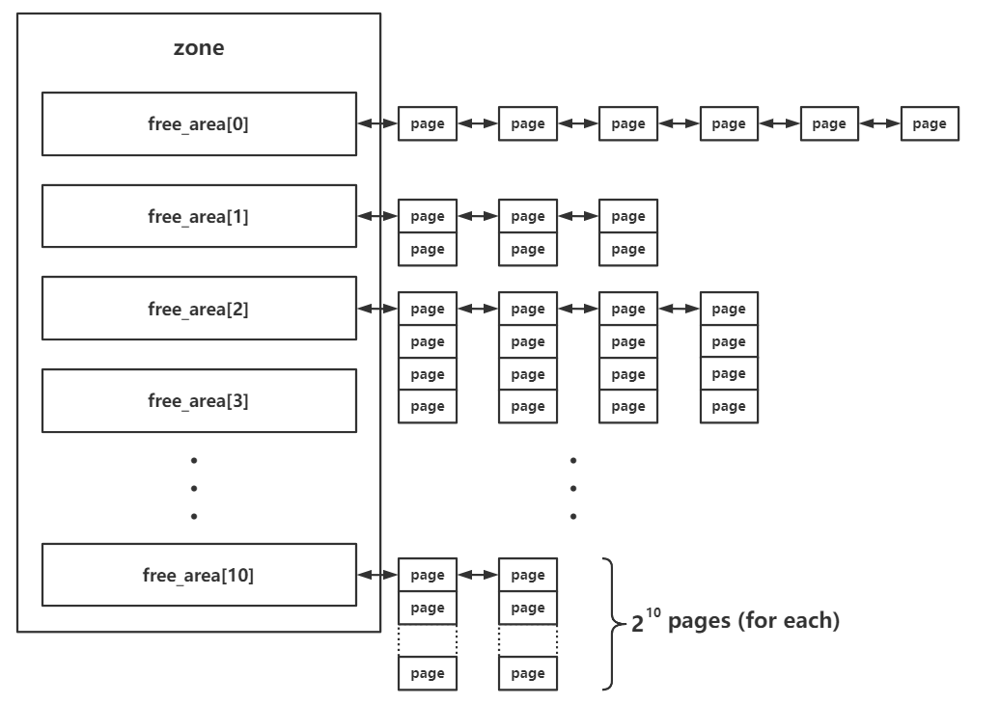

## buddy-system

页级别的内存管理 $2^{order}$

alloc_pages
free_page

### 形式

- struct zone -> free_area\[MAX_ORDER\]，MAX_ORDER为11。并且内存是连续的。


1. free_area
```c
struct free_area {
	struct list_head	free_list[MIGRATE_TYPES];
	unsigned long		nr_free;
};
```

- free_area
    - free_list 字段便是用以存放指向空闲页面的指针，其通过 page 结构体的 lru 字段将 page 结构体连接成双向链表
    - nr_free记录了在当前 free_area 中的空闲页面块的数量，对于 free_area[0] 以外的 free_area 而言其单位并非是单个页框，而是以_内存块_为单位

### 分配页

buddy system 提供了一组用以进行页面分配的接口

如果比order较小的内存没有了，就会切割order较大的内存来填充。

#### GFP masks: get free page


1. 内存管理区修饰符
2. 移动和替换修饰符
3. watermark modifiers
4. 回收修饰符
5. 行为修饰符
6. 组合类型标志

具体的可以查看[此处文章](https://arttnba3.cn/2022/06/30/OS-0X03-LINUX-KERNEL-MEMORY-5.11-PART-II/#%E4%B8%80%E3%80%81GFP%EF%BC%88get-free-page%EF%BC%89%E6%A0%87%E5%BF%97%E4%BD%8D)

#### alloc context

- 结构体如下
```c
struct alloc_context {
	struct zonelist *zonelist;
	nodemask_t *nodemask;
	struct zoneref *preferred_zoneref;
	int migratetype;

	/*
	 * highest_zoneidx 表示分配请求中最高的可用 zone 的下标。
	 * 由于 zone 的性质, 相较于 highest_zoneidx，
	 * 在更低的 zone 上的内存会由 lowmem_reserve[highest_zoneidx] 保护。
	 * 译注：就是水位线机制，不记得的回去看上一篇文章
	 *
	 * highest_zoneidx 同样被回收/压缩使用以限制目标 zone，
	 * 因为高于该下标的 zone 无法用于此分配请求
	 */
	enum zone_type highest_zoneidx;
	bool spread_dirty_pages;
};
```
#### __alloc_pages_nodemask()

分配页面的「核心函数」，返回 page 结构体

#### 上层API

```c
__alloc_pages_node  /*返回struct page的指针*/
    __alloc_pages
    	__alloc_pages_nodemask

alloc_pages         /*返回struct page的指针*/
    alloc_pages_current
    	__alloc_pages_nodemask
        
__get_free_pages    /*返回页面的虚拟地址*/
    alloc_pages
        alloc_pages_current
            __alloc_pages_nodemask
```

### 回收页

将相邻的物理内存，如过可以合并就合并，合并一个较大的order，放入一个free_area中

#### __free_one_page()

释放页面的核心函数，所有释放页都会调用此函数

