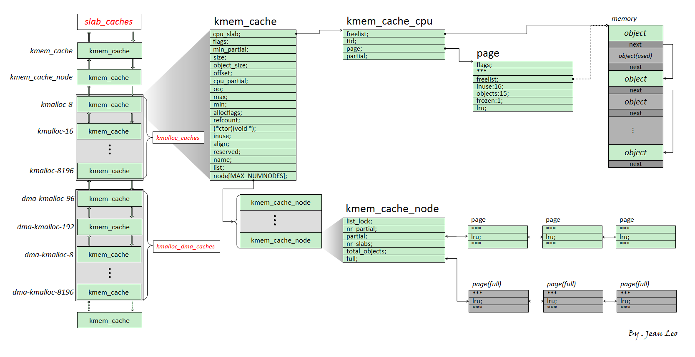

## slab

slub allocator 负责向 buddy system 请求内存后分割给多个小 object 后再返还给上层调用者，单次向 buddy system 所请求的一份连续内存页便称之为一张 slab，在内核中对应 slab 结构体，本质上是复用 page 结构体：

buddy system返回的是一个页，而我们可能不会用到一个页的内存，只需要很小的内存，这时就需要slab管理器

object: 我们alloc获得的内存对象



- include/linux/slab.h && include/linux/slab_def.h && mm/slab.h

### slab管理

- mm/slab.h, 将slab, slub, slob一起管理。一般使用slub
```c
struct slab {
	unsigned long __page_flags;

#if defined(CONFIG_SLAB)

	union {
		struct list_head slab_list;
		struct rcu_head rcu_head;
	};
	struct kmem_cache *slab_cache;
	void *freelist;	/* array of free object indexes */
	void *s_mem;	/* first object */
	unsigned int active;

#elif defined(CONFIG_SLUB)           // slub

	union {
		struct list_head slab_list;
		struct rcu_head rcu_head;
#ifdef CONFIG_SLUB_CPU_PARTIAL
		struct {
			struct slab *next;
			int slabs;	/* Nr of slabs left */
		};
#endif
	};
	struct kmem_cache *slab_cache;
	/* Double-word boundary */
	void *freelist;		/* first free object */
	union {
		unsigned long counters;
		struct {
			unsigned inuse:16;
			unsigned objects:15;
			unsigned frozen:1;
		};
	};
	unsigned int __unused;

#elif defined(CONFIG_SLOB)

	struct list_head slab_list;
	void *__unused_1;
	void *freelist;		/* first free block */
	long units;
	unsigned int __unused_2;

#else
#error "Unexpected slab allocator configured"
#endif

	atomic_t __page_refcount;
#ifdef CONFIG_MEMCG
	unsigned long memcg_data;
#endif
};
```

slab_cache ：该 slab 对应的内存池，为`struct kmem_cache *`
freelist ：slab 上的空闲对象组织为一个 NULL 结尾的单向链表，该指针指向第一个空闲对象，耗尽时为 NULL
slab_list ：按用途连接多个 slabs 的双向链表
inuse ：已被使用的对象数量
objects：该 slab 上的对象总数
frozen：是否被冻结，即已经归属于特定的 CPU

### kmem_cache 

特定大小的内存缓冲
```c
struct kmem_cache *
kmalloc_caches[NR_KMALLOC_TYPES][KMALLOC_SHIFT_HIGH + 1] __ro_after_init =
{ /* initialization for https://bugs.llvm.org/show_bug.cgi?id=42570 */ };
EXPORT_SYMBOL(kmalloc_caches);
```

- 结构 include/linux/slub_def.h
```c
struct kmem_cache {
	struct kmem_cache_cpu __percpu *cpu_slab;
	/* Used for retrieving partial slabs, etc. */
	slab_flags_t flags;
	unsigned long min_partial;
	unsigned int size;	/* The size of an object including metadata */
	unsigned int object_size;/* The size of an object without metadata */
	struct reciprocal_value reciprocal_size;
	unsigned int offset;	/* Free pointer offset */
#ifdef CONFIG_SLUB_CPU_PARTIAL
	/* Number of per cpu partial objects to keep around */
	unsigned int cpu_partial;
	/* Number of per cpu partial slabs to keep around */
	unsigned int cpu_partial_slabs;
#endif
	struct kmem_cache_order_objects oo;

	/* Allocation and freeing of slabs */
	struct kmem_cache_order_objects min;
	gfp_t allocflags;	/* gfp flags to use on each alloc */
	int refcount;		/* Refcount for slab cache destroy */
	void (*ctor)(void *);
	unsigned int inuse;		/* Offset to metadata */
	unsigned int align;		/* Alignment */
	unsigned int red_left_pad;	/* Left redzone padding size */
	const char *name;	/* Name (only for display!) */
	struct list_head list;	/* List of slab caches */
#ifdef CONFIG_SYSFS
	struct kobject kobj;	/* For sysfs */
#endif
#ifdef CONFIG_SLAB_FREELIST_HARDENED
	unsigned long random;
#endif

#ifdef CONFIG_NUMA
	/*
	 * Defragmentation by allocating from a remote node.
	 */
	unsigned int remote_node_defrag_ratio;
#endif

#ifdef CONFIG_SLAB_FREELIST_RANDOM
	unsigned int *random_seq;
#endif

#ifdef CONFIG_KASAN
	struct kasan_cache kasan_info;
#endif

	unsigned int useroffset;	/* Usercopy region offset */
	unsigned int usersize;		/* Usercopy region size */

	struct kmem_cache_node *node[MAX_NUMNODES];
};
```

cpu_cache:  单个CPU缓存
size        一个对象的object大小
object_size 一个对象的数据大小。因为存在对其问题
node[]        一个 kmem_cache_node 数组，对应多个不同 node 的后备内存池（cpu_cache首先使用）

#### slab alias

slab alias 机制是一种对同等/相近大小 object 的 kmem_cache 进行复用的一种机制。

#### kmem_cache_cpu

- 结构。
    - freelist存放下一个可以获得的object。
    - partial: 使用了部分的slab的页
    - slab: 指向我们原始的slab地址，根据这个寻找page?
```c
struct kmem_cache_cpu {
	void **freelist;	/* Pointer to next available object */
	unsigned long tid;	/* Globally unique transaction id */
	struct slab *slab;	/* The slab from which we are allocating */
#ifdef CONFIG_SLUB_CPU_PARTIAL
	struct slab *partial;	/* Partially allocated frozen slabs */
#endif
	local_lock_t lock;	/* Protects the fields above */
#ifdef CONFIG_SLUB_STATS
	unsigned stat[NR_SLUB_STAT_ITEMS];
#endif
};
```

#### kmem_cache_node

```c
#ifndef CONFIG_SLOB
/*
 * The slab lists for all objects.
 */
struct kmem_cache_node {
#ifdef CONFIG_SLAB
	//...
#endif

#ifdef CONFIG_SLUB
	spinlock_t list_lock;
	unsigned long nr_partial;
	struct list_head partial;
#ifdef CONFIG_SLUB_DEBUG
	atomic_long_t nr_slabs;
	atomic_long_t total_objects;
	struct list_head full;
#endif
#endif

};
```


### 分配/释放

```c
static __always_inline void *slab_alloc(struct kmem_cache *s,
        gfp_t gfpflags, unsigned long addr)
{
    return slab_alloc_node(s, gfpflags, NUMA_NO_NODE, addr);
}
static __always_inline void do_slab_free(struct kmem_cache *s,
				struct slab *slab, void *head, void *tail,
				int cnt, unsigned long addr)
    // 快速路径
    __slab_free(s, page, head, tail_obj, cnt, addr);
```

### 用户常用API

```c
#include <linux/slab.h>

// 会创建slab
struct kmem_cache 
*kmem_cache_create (const char *name, size_t size, size_t align, unsigned long flags, void (*ctor)(void *))

void kmem_cache_destroy(struct kmem_cache *cachep)

void *kmem_cache_alloc(struct kmem_cache *cachep, gfp_t f flags)

void kmem_cache_free(struct kmem_cache *cachep, void *objp)
```